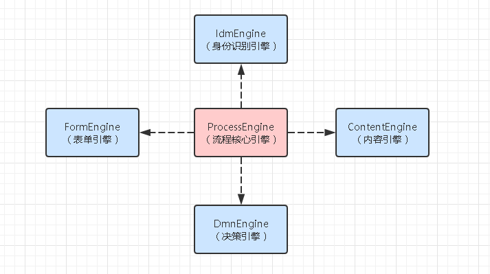
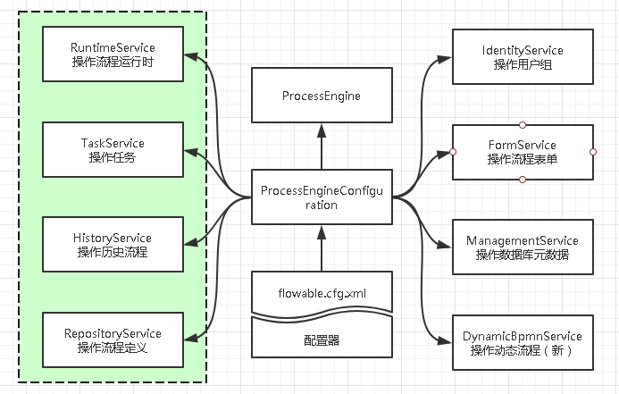
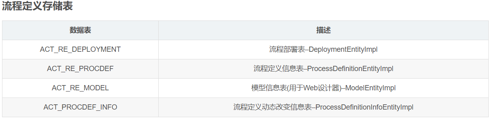
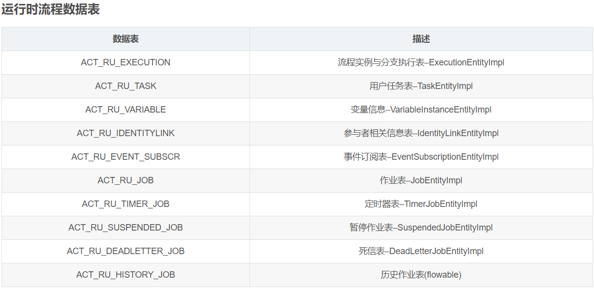
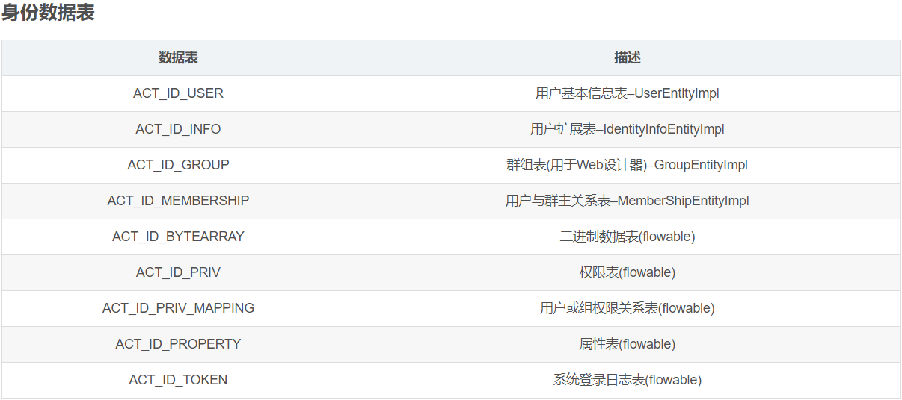
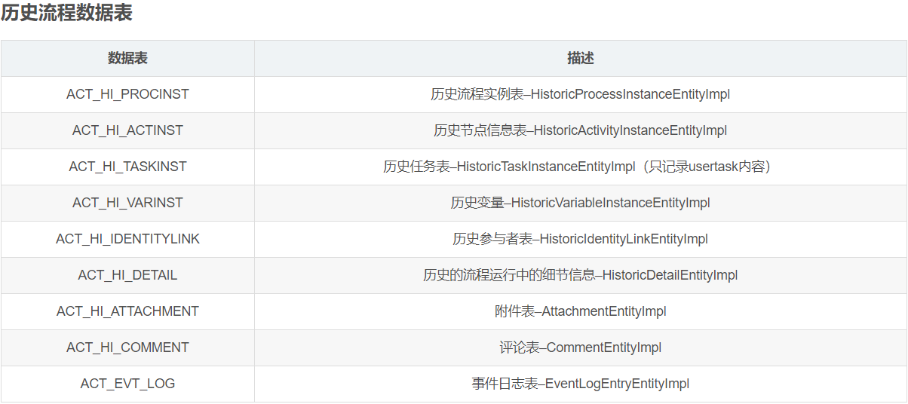
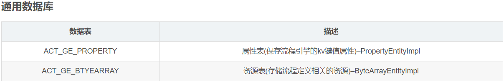

# 工作流引擎 Flowable

工作流是将一组任务组织起来以完成某个经营过程，这个任务定义了触发顺序和触发条件，可以由一个或多个软件系统完成，也可以由一个或一组人完成，还可以由一个或多个人与软件系统协作完成。

通过工作流技术将工作分解成定义良好的任务、角色，按照一定的规则和过程来执行这些任务并对它们进行监控。可以提高办事效率、降低生产成本。提高企业生产经营管理水乎和企业的竞争力。实现现代企业经营过程自动化。

Flowable是一个流行的轻量级的采用Java开发的业务流程引擎。通过Flowable流程引擎，我们可以部署BPMN2.0的流程定义(一般为XML文件)，通过流程定义创建流程实例，查询和访问流程相关的实例与数据等等。

官网地址：https://www.flowable.com/

## 一、核心介绍

### 1.1 五大引擎：

- 内容引擎
- 身份识别引擎
- 表单引擎
- 决策引擎
- 流程引擎

### 1.2 流程引擎使用架构

Flowable引擎在使用前需要先通过配置来初始化ProcessEngine。 初始化ProcessEngineConfiguration一般有两种方式：

1. 通过Spinrg配置文件进行依赖注入，通过flowable.cfg.xml文件来初始化ProcessEngineConfiguration（这里的文件名必须为flowable.cfg.xml，否则Flowable识别不到）

2. 通过编写程序的方式来构造ProcessEngineConfiguration对象
   

### 1.3 Flowable 数据表清单

Flowable的所有数据库表都以ACT_开头，第二部分是说明表用途的两字符标示符。服务API的命名也大略符合这个规则。

- ACT_RE_*: 'RE’代表 repository 。带有这个前缀的表包含“静态”信息，例如流程定义与流程资源（图片、规则等）。
  

- ACT_RU_*: 'RU’代表 runtime 。（15张表）这些表存储运行时信息，例如流程实例（process instance）、用户任务（user task）、变量
  （variable）、作业（job）等。Activiti只在流程实例运行中保存运行时数据，并在流程实例结束时删除记录。这样保证运行时表小和 快。
  

- ACT_ID_*: 'ID’代表 identity 。（9张表）这些表包含身份信息，例如用户、组等。
  

- ACT_HI_*: 'HI’代表 history 。（10张表）这些表存储历史数据，例如已完成的流程实例、变量、任务等。
  

- ACT_GE_*: 通用数据。（2张表）用于各种情况都使用的数据。
  

- ACT_EVT_*: 事件表。主要存放事件信息和事件日志等。

- ACT_PROCDEF_*: 流程定义表，流程定义历史更新数据。

### 1.4 Flowable 核心表

- 部署内容表：act_ge_bytearray
- 部署ID表：act_re_deployment
- 流程表：act_re_procdef
- 历史节点表：act_hi_actinst
- 历史任务流程实例信息 ：act_hi_taskinst
- 流程变量数据表：act_ru_variable
- 历史变量表：act_hi_varinst
- 流程实例历史：act_hi_procinst
- 历史流程人员表：act_hi_identitylink
- 运行时流程人员表：act_ru_identitylink
- 运行时任务节点表：act_ru_task

## 二、Awesome_Workflow 工作流功能实现

### 2.1 基本功能介绍

1. 模型管理：在线流程设计器、导入导出xml、复制流程、部署流程；
2. 流程管理：导入导出流程资源文件、查看流程图、根据流程实例反射出流程模型、激活挂起；
3. 运行中流程（流程实例）管理：查看流程信息、当前任务节点、当前流程图、作废暂停流程、指派待办人、自由跳转；
4. 历史的流程管理：查看流程信息、流程用时、流程状态、查看任务发起人信息；
5. 待办任务管理：查看本人个人任务以及本角色下的任务、办理、驳回、作废、指派一下代理人；
6. 已办任务管理：查看自己办理过的任务以及流程信息、流程图、流程状态(作废 驳回 正常完成)；

备注：

- 办理任务时候可以选择用户进行抄送，就是给被抄送人发送站内信通知当前审批意见以及备注信息；
- 当办理完当前任务时，下一任务待办人会即时通讯收到新任务消息提醒，当作废和完结任务时, 任务发起人会收到站内信消息通知；

### 2.2 命令模式执行代码

实现Command<Void>接口 泛型里面是我们的返回值的类型，这里用Void是无返回值的，然后重写execute方法。

- 模型定义及模型图片生成
- 模型部署（生成流程定义）
- 获取流程定义
- 任务读取
- 任务抄送
- 任务回退

### 2.3 工作流模型（Model）功能
